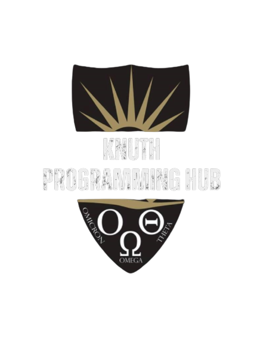

# ** Knuth Programming Hub Documentation**

[How to run the project locally](RunningLocally.md)

[What does Each Configuration Parameter Means?](./ConfigurationParameter.md)

[Packages Used](./PackagesUsed.md)

